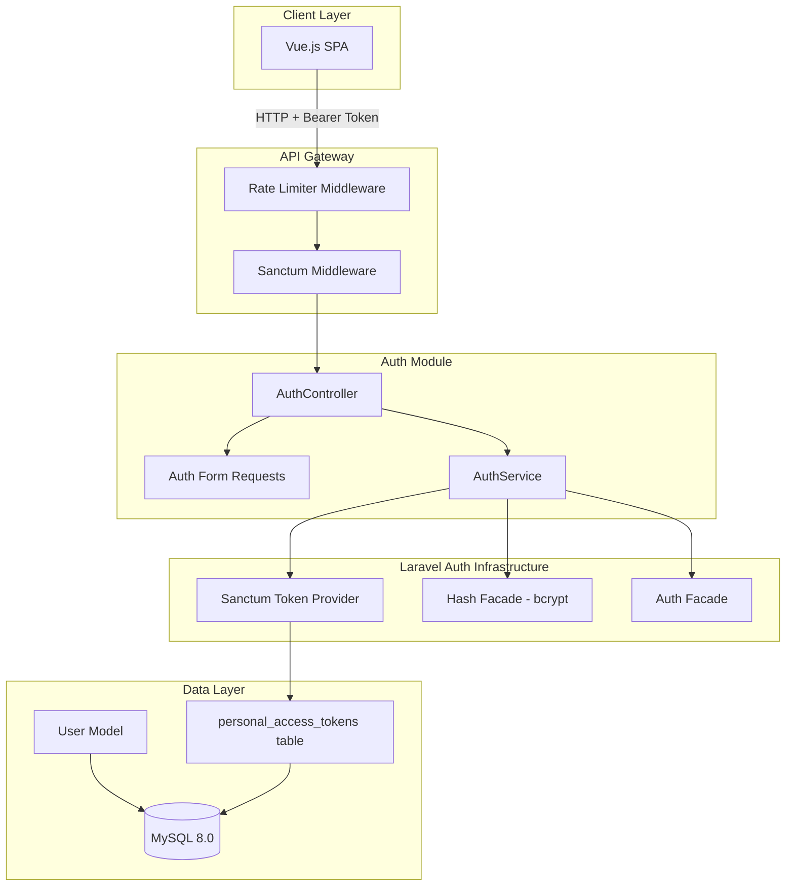
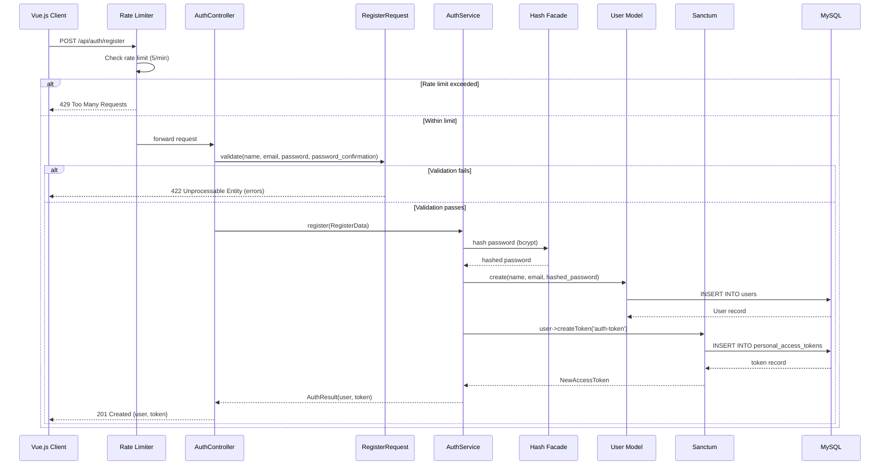
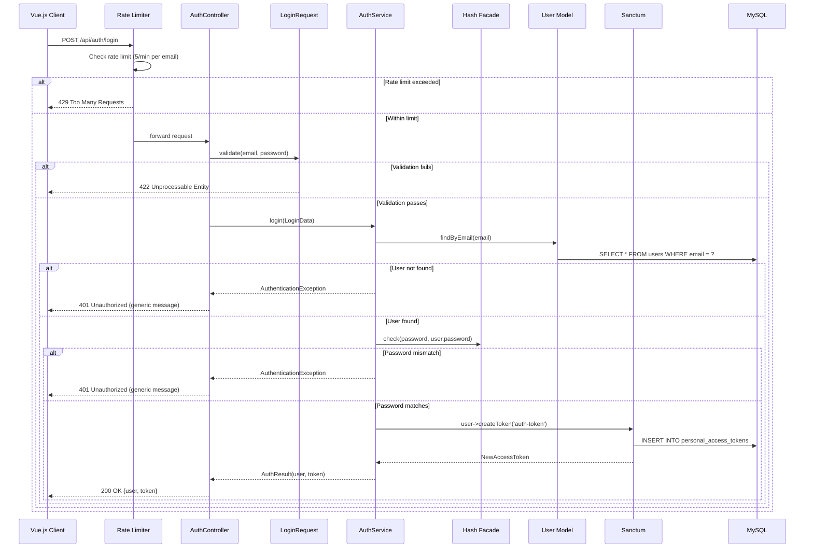
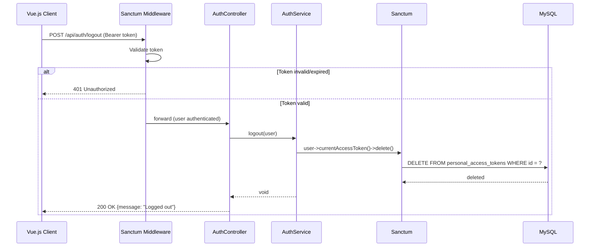
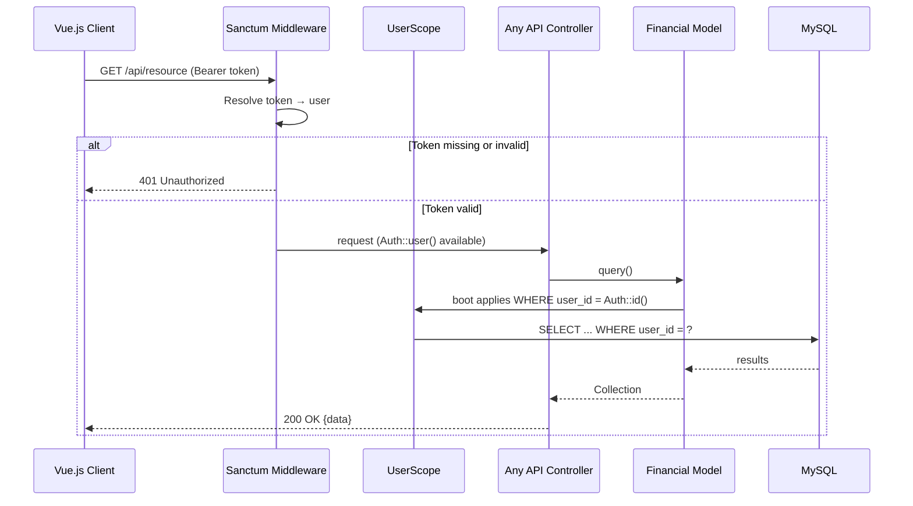

# Design Document: Auth Module

## Overview

The Auth Module provides token-based API authentication for the Budget & Expense Tracker using Laravel Sanctum. It handles user registration, login, logout, and protected route access — establishing the authenticated identity that all downstream features (UserScope, audit trails, financial records) depend on.

This module exposes REST endpoints (not GraphQL) for authentication operations, following the common pattern of keeping auth outside the GraphQL layer. Once authenticated, the user receives a personal access token that must accompany all subsequent API requests. The token integrates with Laravel's native `Auth` facade, enabling the existing `BelongsToUser` trait and `UserScope` global scope to resolve the authenticated user seamlessly.

The design prioritizes security defaults: bcrypt password hashing, rate-limited auth endpoints, configurable token expiry, and minimal token abilities for the single-user personal finance context.

## Architecture

## Sequence Diagrams

### User Registration Flow

### User Login Flow

### User Logout Flow

### Protected Route Access Flow

## Components and Interfaces

### Component 1: AuthController

**Purpose**: Thin REST controller that accepts authentication requests, delegates to AuthService, and returns JSON responses. Follows the single-action or RESTful resource pattern.

**Endpoints**:
| Method | URI | Action | Auth Required |
|--------|-----|--------|---------------|
| POST | `/api/auth/register` | Register new user | No |
| POST | `/api/auth/login` | Authenticate user | No |
| POST | `/api/auth/logout` | Revoke current token | Yes |
| GET | `/api/auth/user` | Get authenticated user profile | Yes |

**Responsibilities**:
- Accept validated request input from Form Requests
- Delegate all business logic to AuthService
- Return appropriate HTTP status codes (201, 200, 401, 422, 429)
- Never contain authentication logic directly

### Component 2: AuthService

**Purpose**: Contains all authentication business logic — user creation with password hashing, credential verification, and token lifecycle management.

**Responsibilities**:
- Hash passwords via Laravel's Hash facade (bcrypt, cost factor 12)
- Verify credentials against stored hashes
- Create and revoke Sanctum personal access tokens
- Return generic error messages for failed authentication (prevent user enumeration)
- Wrap registration in a database transaction (user + token creation)

### Component 3: Form Requests

**Purpose**: Validate and authorize incoming authentication requests before they reach the controller.

**RegisterRequest validation**:
- `name`: required, string, max 255 characters
- `email`: required, valid email format, unique in users table, max 255 characters
- `password`: required, string, min 8 characters, confirmed (requires `password_confirmation`)

**LoginRequest validation**:
- `email`: required, valid email format
- `password`: required, string

**Responsibilities**:
- Validate input format and constraints
- Return structured 422 error responses for invalid input
- Keep validation separate from business logic

### Component 4: User Model (Updated)

**Purpose**: Extended with Sanctum's `HasApiTokens` trait to enable personal access token creation and management.

**Updates Required**:
- Add `HasApiTokens` trait from Laravel Sanctum
- No schema changes to the `users` table (Sanctum uses its own `personal_access_tokens` table)
- Retains existing `HasFactory`, `Notifiable` traits
- Password field already uses `hashed` cast (bcrypt by default)

**Responsibilities**:
- Create personal access tokens via `createToken()`
- Retrieve current access token via `currentAccessToken()`
- Delete tokens on logout or bulk-revoke

### Component 5: Sanctum Middleware Configuration

**Purpose**: Configures Laravel Sanctum as the API authentication guard for protected routes.

**Responsibilities**:
- Resolve bearer tokens from the `Authorization` header
- Authenticate requests and populate `Auth::user()`
- Reject unauthenticated requests with 401 status
- Support token expiration checking (configurable TTL)
- Integrate with Laravel's `auth:sanctum` middleware

### Component 6: Rate Limiting Configuration

**Purpose**: Protects authentication endpoints from brute-force and credential stuffing attacks.

**Responsibilities**:
- Limit registration: 5 attempts per minute per IP
- Limit login: 5 attempts per minute per email+IP combination
- Return 429 Too Many Requests with `Retry-After` header
- Configured in `RouteServiceProvider` or `bootstrap/app.php` (Laravel 12)

## Data Models

### User Model (Existing — Extended)

| Column | Type | Constraints | Purpose |
|--------|------|-------------|---------|
| `id` | bigint unsigned | PK, auto-increment | Primary key |
| `name` | string(255) | required | User display name |
| `email` | string(255) | required, unique, RFC-valid | Login identifier |
| `password` | string(255) | required, bcrypt hash | Authentication credential |
| `email_verified_at` | timestamp | nullable | Email verification timestamp |
| `remember_token` | string(100) | nullable | Session remember token |
| `created_at` | timestamp | auto | Record creation time |
| `updated_at` | timestamp | auto | Last modification time |

**Sanctum Extension**: The User model gains token management capabilities by adding the `HasApiTokens` trait. This enables creating personal access tokens, retrieving the current token, and managing the token relationship.

**Validation Rules**:
- `name`: required, string, 1–255 characters
- `email`: required, RFC-valid email, unique, max 255
- `password`: bcrypt hash, never exposed in API responses (hidden from serialization)

### PersonalAccessToken Model (Sanctum — Automatic)

Sanctum creates and manages this table via its published migration:

| Column | Type | Purpose |
|--------|------|---------|
| `id` | bigint unsigned | Primary key |
| `tokenable_type` | string | Polymorphic type (`App\Models\User`) |
| `tokenable_id` | bigint unsigned | User ID |
| `name` | string | Token name (e.g., `auth-token`) |
| `token` | string(64) | SHA-256 hash of the plain-text token |
| `abilities` | text (JSON) | Token permissions (default `['*']`) |
| `last_used_at` | timestamp nullable | Last API request timestamp |
| `expires_at` | timestamp nullable | Token expiration |
| `created_at` | timestamp | When token was issued |
| `updated_at` | timestamp | Last modification |

**Validation Rules**:
- `token` column stores a SHA-256 hash — plain-text token is returned only once at creation
- `expires_at` is nullable; when set, expired tokens are rejected by Sanctum middleware
- `tokenable_type` + `tokenable_id` form a polymorphic relationship to the User

## Correctness Properties

*A property is a characteristic or behavior that should hold true across all valid executions of a system — essentially, a formal statement about what the system should do. Properties serve as the bridge between human-readable specifications and machine-verifiable correctness guarantees.*

### Property 1: Registration Creates Valid User and Token

*For any* valid registration input (unique email, password ≥ 8 characters, matching confirmation, non-empty name), the system SHALL create exactly one user record with the provided name and email, a bcrypt-hashed password, and return a valid Sanctum token that authenticates subsequent requests.

**Validates: Requirements 1.1, 1.8**

### Property 2: Password Never Stored in Plaintext

*For any* user record in the database created through registration, the `password` column SHALL contain a valid bcrypt hash with cost factor 12 that does not equal the original plaintext password. The plaintext password is never persisted or included in API responses.

**Validates: Requirements 1.2, 7.1, 7.2**

### Property 3: Invalid Registration Input is Rejected

*For any* registration input that violates validation rules (password < 8 characters, mismatched confirmation, invalid email format), the system SHALL return HTTP 422 and not create a user record in the database.

**Validates: Requirements 1.4, 1.5, 1.7**

### Property 4: Login Returns Token Only for Valid Credentials

*For any* login attempt, the system SHALL return a token if and only if the email matches an existing user AND the provided password matches the stored bcrypt hash. All other credential combinations SHALL return HTTP 401.

**Validates: Requirements 2.1, 2.2, 2.3**

### Property 5: User Enumeration Prevention

*For any* failed login attempt — whether due to non-existent email or incorrect password — the system SHALL return an identical HTTP 401 response body and status code. The response must not reveal whether the email exists in the system.

**Validates: Requirements 2.3, 2.4, 7.4**

### Property 6: Logout Invalidates Current Token

*For any* valid authenticated session, after calling the logout endpoint, the previously-valid token SHALL no longer authenticate any subsequent request. The token record SHALL be deleted from `personal_access_tokens`.

**Validates: Requirements 3.1, 3.2**

### Property 7: Token Expiry Enforcement

*For any* token with a non-null `expires_at` value, the system SHALL reject authentication attempts using that token after the expiry timestamp has passed, returning HTTP 401 Unauthorized.

**Validates: Requirements 4.1, 4.2**

### Property 8: Token Stored as SHA-256 Hash

*For any* token created via registration or login, the database SHALL store only the SHA-256 hash of the plain-text token. The plain-text token value SHALL not appear in the `personal_access_tokens` table.

**Validates: Requirements 4.3**

### Property 9: Protected Routes Require Valid Token

*For any* request to a protected API endpoint that is missing the Authorization header, includes an invalid token, or includes a revoked token, the system SHALL return HTTP 401 Unauthorized.

**Validates: Requirements 5.1, 5.2, 5.3**

### Property 10: User Data Isolation

*For any* two distinct authenticated users, queries executed in the context of user A SHALL never return records belonging to user B. The UserScope global scope ensures all queries are filtered by the authenticated user's ID.

**Validates: Requirements 5.4**

### Property 11: Rate Limiting Enforcement

*For any* sequence of authentication requests exceeding the configured threshold (5 per minute), the system SHALL reject subsequent requests with HTTP 429 and a Retry-After header until the rate limit window resets.

**Validates: Requirements 6.1, 6.2, 6.3**

### Property 12: Profile Returns Correct User Data

*For any* authenticated user, a GET request to the user profile endpoint SHALL return an HTTP 200 response containing that user's id, name, and email — and SHALL NOT include the password field.

**Validates: Requirements 8.1, 7.2**

## Error Handling

### Error Scenario 1: Invalid Credentials

**Condition**: Email doesn't exist or password doesn't match
**Response**: 401 Unauthorized with generic message `{"message": "Invalid credentials"}`
**Recovery**: Client prompts user to retry
**Security Note**: Response must NOT indicate whether the email exists (prevent enumeration)

### Error Scenario 2: Duplicate Email Registration

**Condition**: Email already exists in users table
**Response**: 422 Unprocessable Entity with validation error `{"errors": {"email": ["The email has already been taken."]}}`
**Recovery**: Client prompts user to use a different email or attempt login

### Error Scenario 3: Rate Limit Exceeded

**Condition**: Too many authentication attempts from same IP/email
**Response**: 429 Too Many Requests with `Retry-After` header
**Recovery**: Client shows cooldown timer, retries after delay

### Error Scenario 4: Expired or Revoked Token

**Condition**: Token in Authorization header is expired or has been deleted
**Response**: 401 Unauthorized with `{"message": "Unauthenticated."}`
**Recovery**: Client redirects to login page, clears stored token

### Error Scenario 5: Missing Authorization Header

**Condition**: Protected route accessed without Bearer token
**Response**: 401 Unauthorized with `{"message": "Unauthenticated."}`
**Recovery**: Client redirects to login page

### Error Scenario 6: Weak Password

**Condition**: Password doesn't meet minimum requirements (< 8 characters)
**Response**: 422 Unprocessable Entity with validation errors
**Recovery**: Client shows password requirements to user

## Testing Strategy

### Unit Testing Approach

- **AuthService**: Test credential verification logic, password hashing, token creation in isolation
- **Form Requests**: Test validation rules accept valid input and reject invalid input
- **Rate Limiting**: Test that limits are enforced at configured thresholds

### Integration Testing Approach

- **Registration flow**: POST to `/api/auth/register` → verify user created in DB, token returned
- **Login flow**: POST to `/api/auth/login` → verify token returned for valid credentials
- **Logout flow**: POST to `/api/auth/logout` → verify token deleted from DB
- **Protected routes**: Verify 401 without token, 200 with valid token
- **User enumeration**: Verify identical error response for non-existent email vs wrong password
- **Token expiry**: Verify expired tokens are rejected

### Property-Based Testing Approach

**Property Test Library**: PHPUnit with data providers (or Pest datasets for future migration)

- **Property: Password never stored in plaintext** — For any registration with any valid password, the stored value in the database must not equal the plain-text input
- **Property: Token uniqueness** — For any number of token creations, no two tokens share the same hash
- **Property: Logout invalidation** — For any valid token, after logout the same token must return 401

## Security Considerations

### Password Storage
- Bcrypt hashing with cost factor 12 (Laravel default)
- Password field uses `hashed` cast — never stored or logged in plaintext
- `password` column excluded from serialization via `$hidden` array

### Token Security
- Plain-text token returned only once at creation (login/register response)
- Database stores SHA-256 hash of the token — compromised DB doesn't expose tokens
- Token transmitted only via HTTPS `Authorization: Bearer` header
- Configurable token expiry (recommended: 7 days for this personal app)

### Rate Limiting
- Registration: 5 requests/minute per IP address
- Login: 5 requests/minute per email+IP combination
- Prevents brute-force attacks and credential stuffing
- Returns standard `429` with `Retry-After` header

### User Enumeration Prevention
- Login failure returns identical response regardless of whether email exists
- Response time should be consistent (hash check runs even for non-existent users)
- Registration uniqueness check is acceptable (standard practice for email-based auth)

### CORS & Token Handling
- API tokens are stateless — no CSRF vulnerability
- CORS configured to allow only the SPA origin in production
- Tokens should be stored in `localStorage` or `sessionStorage` on the client (acceptable for personal single-user app; HttpOnly cookies are an alternative for multi-user production apps)

### Session Fixation
- Not applicable — Sanctum tokens are stateless and not tied to sessions
- Each login creates a fresh token

## Performance Considerations

- Bcrypt hashing is intentionally slow (~100ms per hash at cost 12) — acceptable for auth endpoints that are called infrequently
- Token lookup is indexed by the first 40 characters of the hash for fast resolution
- Rate limiting uses Laravel's cache driver (file or Redis) — minimal overhead
- The `personal_access_tokens` table should be pruned periodically to remove expired tokens (scheduled command)

## Dependencies

| Package | Version | Purpose |
|---------|---------|---------|
| `laravel/sanctum` | ^4.0 | Token-based API authentication |

**Installation**: `composer require laravel/sanctum`

**Post-install steps**:
1. Publish Sanctum config: `php artisan vendor:publish --provider="Laravel\Sanctum\SanctumServiceProvider"`
2. Run Sanctum migration: `php artisan migrate` (creates `personal_access_tokens` table)
3. Add `HasApiTokens` trait to `User` model
4. Configure `auth` guard in `config/auth.php` to use Sanctum
5. Add Sanctum middleware to API route group in `bootstrap/app.php`
