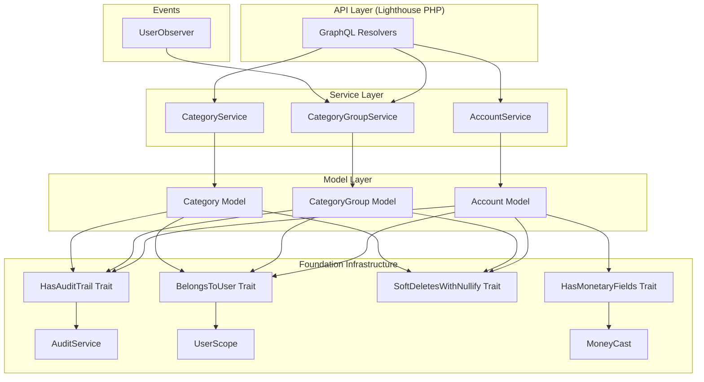
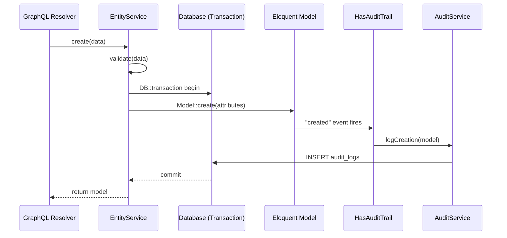
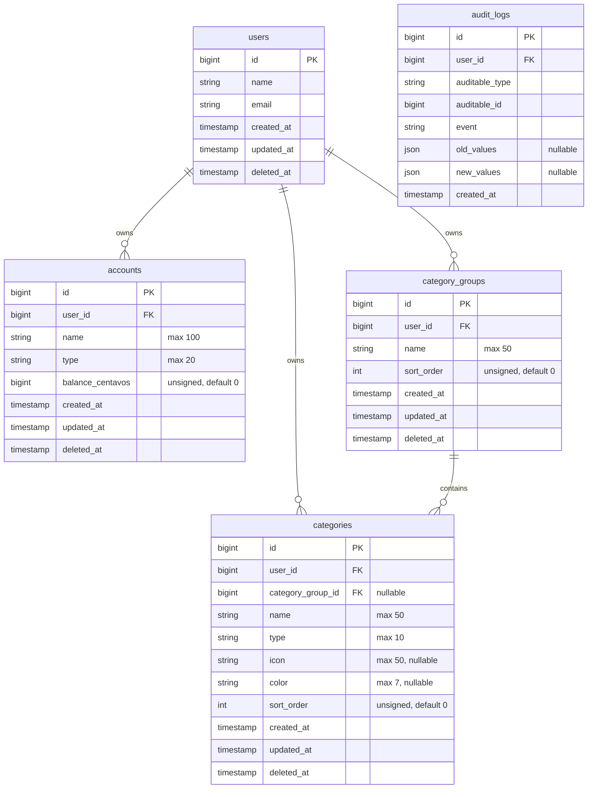
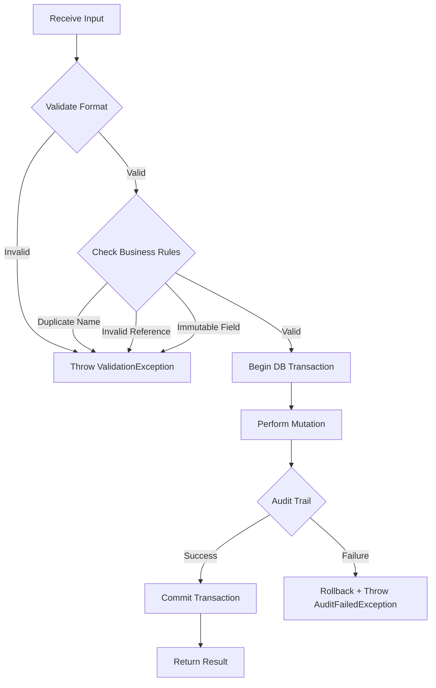

# Design Document: Core Entities

## Overview

This design implements the three foundational domain models for the Budget & Expense Tracker: **Account**, **CategoryGroup**, and **Category**. These entities serve as the data backbone that all downstream features (transactions, budgets, installments) depend on.

Each entity composes existing foundation infrastructure traits (`BelongsToUser`, `HasAuditTrail`, `SoftDeletesWithNullify`, `HasMonetaryFields`) and exposes a dedicated service class that encapsulates CRUD operations with validation, audit logging, and soft-delete lifecycle management.

### Design Decisions

1. **Service-per-entity pattern**: Each entity gets its own service class (`AccountService`, `CategoryGroupService`, `CategoryService`) to maintain single responsibility and avoid a monolithic "CoreEntityService."

2. **Validation in services, not Form Requests**: Since the API layer is GraphQL (Lighthouse PHP), validation lives in the service layer rather than Laravel Form Requests. Lighthouse resolvers will delegate directly to services. This keeps validation co-located with business logic and reusable across entry points (GraphQL, CLI seeders, event listeners).

3. **No repository layer**: Following the project's KISS principle, services interact with Eloquent models directly. The queries are simple CRUD operations — repositories would add indirection without value at this stage.

4. **Default category groups via Observer**: The four default groups created on user registration are handled by a `UserObserver` listening to the `created` event on the User model, keeping the registration logic (AuthService) unchanged and decoupled.

5. **Enum-driven type safety**: `AccountType` and `CategoryType` are PHP 8.4 backed string enums, cast natively by Eloquent, eliminating invalid-type bugs at the PHP level.

## Architecture



### Data Flow — Create Operation



## Components and Interfaces

### Enums

#### `App\Enums\AccountType`

```php
enum AccountType: string
{
    case BankAccount = 'bank_account';
    case EWallet = 'e_wallet';
    case CreditCard = 'credit_card';
    case Cash = 'cash';
}
```

#### `App\Enums\CategoryType`

```php
enum CategoryType: string
{
    case Expense = 'expense';
    case Income = 'income';
}
```

### Models

#### `App\Models\Account`

| Concern | Implementation |
|---------|---------------|
| Traits | `BelongsToUser`, `HasAuditTrail`, `SoftDeletesWithNullify`, `HasMonetaryFields` |
| Fillable | `name`, `type`, `balance_centavos` |
| Casts | `type` → `AccountType::class` (via enum cast), `balance_centavos` → `MoneyCast` (via trait) |
| Auditable fields | `name`, `type`, `balance_centavos` |
| Monetary fields | `balance_centavos` |
| Nullify on delete | `['transactions' => 'account_id']` |

#### `App\Models\CategoryGroup`

| Concern | Implementation |
|---------|---------------|
| Traits | `BelongsToUser`, `HasAuditTrail`, `SoftDeletesWithNullify` |
| Fillable | `name`, `sort_order` |
| Auditable fields | `name`, `sort_order` |
| Nullify on delete | `['categories' => 'category_group_id']` |
| Relationships | `hasMany(Category::class)` |

#### `App\Models\Category`

| Concern | Implementation |
|---------|---------------|
| Traits | `BelongsToUser`, `HasAuditTrail`, `SoftDeletesWithNullify` |
| Fillable | `name`, `type`, `icon`, `color`, `sort_order`, `category_group_id` |
| Casts | `type` → `CategoryType::class` |
| Auditable fields | `name`, `type`, `icon`, `color`, `sort_order`, `category_group_id` |
| Nullify on delete | `['transactions' => 'category_id']` |
| Relationships | `belongsTo(CategoryGroup::class)` |

### Services

#### `App\Services\AccountService`

```php
final class AccountService
{
    public function create(array $data): Account;
    public function update(Account $account, array $data): Account;
    public function delete(Account $account): void;
    public function list(): Collection;
    public function find(int $id): Account;
}
```

**Validation rules (create):**
- `name`: required, string, 1–100 chars after trim, unique among user's non-deleted accounts
- `type`: required, valid `AccountType` value
- `balance_centavos`: optional, integer 0–99,999,999,999, defaults to 0

**Validation rules (update):**
- `name`: optional, string, 1–100 chars after trim, unique excluding self
- `type`: optional, valid `AccountType` value
- `balance_centavos`: rejected (not directly updatable)

#### `App\Services\CategoryGroupService`

```php
final class CategoryGroupService
{
    public function create(array $data): CategoryGroup;
    public function update(CategoryGroup $group, array $data): CategoryGroup;
    public function delete(CategoryGroup $group): void;
    public function list(): Collection;
    public function find(int $id): CategoryGroup;
    public function createDefaults(User $user): void;
}
```

**Validation rules (create):**
- `name`: required, string, 1–50 chars after trim, unique (case-insensitive) among user's non-deleted groups
- `sort_order`: optional, unsigned integer, defaults to 0

**Validation rules (update):**
- `name`: optional, string, 1–50 chars after trim, unique (case-insensitive) excluding self
- `sort_order`: optional, unsigned integer

#### `App\Services\CategoryService`

```php
final class CategoryService
{
    public function create(array $data): Category;
    public function update(Category $category, array $data): Category;
    public function delete(Category $category): void;
    public function list(?int $groupId = null, ?CategoryType $type = null): Collection;
    public function find(int $id): Category;
}
```

**Validation rules (create):**
- `name`: required, string, 1–50 chars after trim, unique within same type per user
- `type`: required, valid `CategoryType` value
- `category_group_id`: required, must reference a non-deleted group belonging to the user
- `icon`: optional, string max 50 chars
- `color`: optional, string max 7 chars
- `sort_order`: optional, unsigned integer, defaults to 0

**Validation rules (update):**
- `name`: optional, string, 1–50 chars after trim, unique within same type per user (excluding self)
- `type`: rejected (immutable after creation)
- `category_group_id`: optional, must reference a non-deleted group belonging to the user
- `icon`: optional, string max 50 chars
- `color`: optional, string max 7 chars
- `sort_order`: optional, unsigned integer

### Observer

#### `App\Observers\UserObserver`

Listens to the `User::created` event and calls `CategoryGroupService::createDefaults($user)` within the same transaction context as user registration.

**Guard clause**: If the user already has category groups (race condition/duplicate event), skip creation.

### Exceptions

#### `App\Exceptions\ValidationException`

Domain-level validation exception thrown by services when business rules are violated. Contains a structured error bag with field-level messages.

#### `App\Exceptions\EntityNotFoundException`

Thrown when a requested entity does not exist, is soft-deleted, or belongs to another user. Returns a uniform "not found" response regardless of reason (no information leakage).

#### `App\Exceptions\DeletionConstraintException`

Thrown when deletion is blocked because the entity has active (non-deleted) dependent records (e.g., account has transactions, group has categories).

### Factories

#### `Database\Factories\AccountFactory`

Generates valid Account instances with random `AccountType`, name (1–100 chars via `fake()->text()`), and `balance_centavos` within valid range. Associates a User via `User::factory()` when no user is explicitly bound.

#### `Database\Factories\CategoryGroupFactory`

Generates valid CategoryGroup instances with random name (1–50 chars) and `sort_order` (0–99). Associates a User via factory default.

#### `Database\Factories\CategoryFactory`

Generates valid Category instances with random name, `CategoryType`, `sort_order` (0–99), null icon/color defaults. Associates both a User and a CategoryGroup (creating one via factory if not provided, ensuring same user ownership).

## Data Models

### Entity-Relationship Diagram



### Migration: `accounts`

| Column | Type | Constraints |
|--------|------|-------------|
| `id` | `unsignedBigInteger` | auto-increment, primary key |
| `user_id` | `unsignedBigInteger` | FK → `users.id` CASCADE on delete |
| `name` | `string(100)` | not null |
| `type` | `string(20)` | not null |
| `balance_centavos` | `unsignedBigInteger` | not null, default 0 |
| `created_at` | `timestamp` | |
| `updated_at` | `timestamp` | |
| `deleted_at` | `timestamp` | nullable |

**Indexes:**
- Partial unique: `(user_id, name) WHERE deleted_at IS NULL`
- Composite: `(user_id, type)`

### Migration: `category_groups`

| Column | Type | Constraints |
|--------|------|-------------|
| `id` | `unsignedBigInteger` | auto-increment, primary key |
| `user_id` | `unsignedBigInteger` | FK → `users.id` CASCADE on delete |
| `name` | `string(50)` | not null |
| `sort_order` | `unsignedInteger` | not null, default 0 |
| `created_at` | `timestamp` | |
| `updated_at` | `timestamp` | |
| `deleted_at` | `timestamp` | nullable |

**Indexes:**
- Partial unique: `(user_id, name) WHERE deleted_at IS NULL`

### Migration: `categories`

| Column | Type | Constraints |
|--------|------|-------------|
| `id` | `unsignedBigInteger` | auto-increment, primary key |
| `user_id` | `unsignedBigInteger` | FK → `users.id` CASCADE on delete |
| `category_group_id` | `unsignedBigInteger` | nullable, FK → `category_groups.id` SET NULL on delete |
| `name` | `string(50)` | not null |
| `type` | `string(10)` | not null |
| `icon` | `string(50)` | nullable |
| `color` | `string(7)` | nullable |
| `sort_order` | `unsignedInteger` | not null, default 0 |
| `created_at` | `timestamp` | |
| `updated_at` | `timestamp` | |
| `deleted_at` | `timestamp` | nullable |

**Indexes:**
- Partial unique: `(user_id, name, type) WHERE deleted_at IS NULL`
- Composite: `(user_id, category_group_id)`

### Partial Unique Index Implementation (MySQL 8.0)

MySQL does not support `WHERE` clauses in unique indexes natively. The partial uniqueness constraint will be implemented as a **unique index on virtual/generated column** pattern:

```sql
-- For accounts: unique active name per user
ALTER TABLE accounts
  ADD COLUMN unique_active_name VARCHAR(100)
    GENERATED ALWAYS AS (IF(deleted_at IS NULL, name, NULL)) STORED;
CREATE UNIQUE INDEX uq_accounts_user_active_name
  ON accounts (user_id, unique_active_name);
```

Alternatively, the application-level uniqueness check in the service layer combined with a standard composite unique index on `(user_id, name, deleted_at)` provides equivalent protection when coordinated with MySQL's behavior of treating NULLs as distinct in unique indexes — meaning multiple soft-deleted records with the same name are permitted while only one active (NULL deleted_at) record per name is enforced.

**Chosen approach**: Standard composite unique indexes including `deleted_at` as a nullable column. MySQL treats each NULL as distinct, so `UNIQUE(user_id, name, deleted_at)` allows multiple soft-deleted duplicates while preventing two active records with the same name. The service layer performs an explicit check as the primary enforcement.

## Correctness Properties

*A property is a characteristic or behavior that should hold true across all valid executions of a system — essentially, a formal statement about what the system should do. Properties serve as the bridge between human-readable specifications and machine-verifiable correctness guarantees.*

### Property 1: Account creation round-trip

*For any* valid account name (1–100 non-whitespace-only characters after trim), valid AccountType, and valid balance (0–99,999,999,999 centavos), creating an account SHALL persist a record whose attributes match the inputs AND produce an audit_log entry with event "created" containing the new field values.

**Validates: Requirements 2.1, 2.6**

### Property 2: Account name validation rejects invalid names

*For any* string that is empty, composed entirely of whitespace, or exceeds 100 characters after trimming, the AccountService SHALL reject account creation or update and return a validation error.

**Validates: Requirements 2.4, 3.2**

### Property 3: Account name uniqueness enforcement

*For any* two account creation/update attempts by the same user with the same trimmed name (where the first account is not soft-deleted), the second attempt SHALL be rejected with a duplicate-name error. If the first account IS soft-deleted, the second attempt SHALL succeed.

**Validates: Requirements 2.5, 3.3**

### Property 4: Account type validation rejects non-enum values

*For any* string that does not match one of the four valid AccountType backing values ("bank_account", "e_wallet", "credit_card", "cash"), the AccountService SHALL reject the operation with an invalid-type error.

**Validates: Requirements 2.3, 3.4**

### Property 5: Account balance range validation

*For any* integer value outside the range [0, 99,999,999,999], the AccountService SHALL reject account creation with an out-of-range validation error.

**Validates: Requirements 2.7**

### Property 6: Account no-change update produces no audit

*For any* existing account, calling update with data where all auditable field values (name, type, balance_centavos) are identical to current values SHALL NOT produce an audit_log entry and SHALL NOT modify the updated_at timestamp.

**Validates: Requirements 3.5**

### Property 7: Account soft-delete lifecycle

*For any* account with no active transactions, soft-deleting it SHALL set only the deleted_at timestamp (all other field values remain unchanged) AND produce an audit_log entry with event "deleted" containing the account's field values at deletion time.

**Validates: Requirements 4.1, 4.3**

### Property 8: Account list returns user-scoped, non-deleted, name-ordered results

*For any* set of accounts across multiple users (mix of active and soft-deleted), the AccountService list operation for a given user SHALL return exactly their non-deleted accounts, sorted alphabetically by name ascending.

**Validates: Requirements 5.1**

### Property 9: CategoryGroup creation round-trip

*For any* valid category group name (1–50 non-whitespace-only characters after trim) and valid sort_order (unsigned integer, defaulting to 0), creating a group SHALL persist a record matching the inputs AND produce an audit_log entry with event "created".

**Validates: Requirements 7.1**

### Property 10: CategoryGroup name uniqueness (case-insensitive)

*For any* two category group names that are identical after trimming and case-folding, if one non-deleted group already exists for a user, creating or renaming another group to that name SHALL be rejected, regardless of letter casing differences.

**Validates: Requirements 7.3, 8.3**

### Property 11: CategoryGroup name validation rejects invalid names

*For any* string that is empty, composed entirely of whitespace, or exceeds 50 characters after trimming, the CategoryGroupService SHALL reject creation or update with a validation error.

**Validates: Requirements 7.2, 8.2**

### Property 12: CategoryGroup no-change update produces no audit

*For any* existing category group, calling update with data where all auditable field values (name, sort_order) are identical to current values SHALL NOT produce an audit_log entry.

**Validates: Requirements 8.4**

### Property 13: CategoryGroup deletion blocked by active categories

*For any* category group that has at least one non-deleted category associated with it, attempting deletion SHALL be rejected with an error. If all associated categories are soft-deleted, deletion SHALL succeed.

**Validates: Requirements 9.2**

### Property 14: CategoryGroup soft-delete lifecycle

*For any* category group with no active categories, soft-deleting it SHALL set only the deleted_at timestamp (all other fields unchanged) AND produce an audit_log entry with event "deleted".

**Validates: Requirements 9.1, 9.3**

### Property 15: CategoryGroup list returns user-scoped, sort_order-ordered results

*For any* set of category groups across multiple users, the list operation for a given user SHALL return exactly their non-deleted groups, sorted by sort_order ascending.

**Validates: Requirements 10.1**

### Property 16: Category creation round-trip

*For any* valid category name (1–50 chars), valid CategoryType, valid category_group_id (belonging to same user, non-deleted), and valid optional fields (icon ≤ 50 chars, color ≤ 7 chars, sort_order unsigned int), creating a category SHALL persist correctly AND produce an audit_log entry with event "created".

**Validates: Requirements 13.1, 13.7**

### Property 17: Category name+type uniqueness per user

*For any* two categories belonging to the same user with the same trimmed name AND the same CategoryType (where the first is non-deleted), the second creation/rename SHALL be rejected. Categories with the same name but DIFFERENT types SHALL coexist.

**Validates: Requirements 13.5, 14.3**

### Property 18: Category name validation rejects invalid names

*For any* string that is empty, composed entirely of whitespace, or exceeds 50 characters after trimming, the CategoryService SHALL reject creation or update with a validation error.

**Validates: Requirements 13.4, 14.2**

### Property 19: Category list filtering preserves correctness

*For any* combination of group filter and type filter applied to a category listing, ALL returned categories SHALL satisfy BOTH filter conditions (if specified), belong to the authenticated user, and be non-deleted. Results SHALL be ordered by sort_order ascending then name ascending.

**Validates: Requirements 16.1, 16.2, 16.3, 16.4**

### Property 20: Category no-change update produces no audit

*For any* existing category, calling update with data where all auditable field values are identical to current values SHALL NOT produce an audit_log entry.

**Validates: Requirements 14.5**

### Property 21: Category icon/color length validation

*For any* icon string exceeding 50 characters or color string exceeding 7 characters, the CategoryService SHALL reject the update with a field-length validation error.

**Validates: Requirements 14.8**

### Property 22: Factory output validity

*For any* invocation of AccountFactory, CategoryGroupFactory, or CategoryFactory, the generated model instance SHALL satisfy all model constraints: name within length limits, type as a valid enum value, balance within range (for accounts), and foreign key references pointing to valid same-user records.

**Validates: Requirements 19.1, 19.2, 19.3**

## Error Handling

### Exception Hierarchy

| Exception | HTTP Status | When Thrown |
|-----------|-------------|------------|
| `ValidationException` | 422 | Business rule violation (invalid name, duplicate, out-of-range balance, immutable field) |
| `EntityNotFoundException` | 404 | Entity doesn't exist, is soft-deleted, or belongs to another user |
| `DeletionConstraintException` | 409 | Entity has active dependent records preventing deletion |
| `AuditFailedException` | 500 | Audit log persistence failure (triggers transaction rollback) |

### Error Response Strategy

1. **Uniform not-found**: Whether an entity doesn't exist, is soft-deleted, or belongs to another user, the response is always the same "not found" error — no information leakage about other users' data.

2. **Validation errors**: Structured as field → message(s) array, compatible with GraphQL error extensions:
   ```json
   {
     "extensions": {
       "validation": {
         "name": ["The name has already been taken."],
         "type": ["The selected type is invalid."]
       }
     }
   }
   ```

3. **Transaction rollback on audit failure**: If the AuditService throws `AuditFailedException`, the wrapping `DB::transaction()` rolls back both the entity mutation and the audit write, maintaining consistency.

4. **Deletion constraint errors**: Return a clear message indicating which dependent entity type blocks deletion (e.g., "Cannot delete account: 3 active transactions are linked to it.").

### Service-Level Validation Flow



## Testing Strategy

### Dual Testing Approach

This feature uses both **unit tests** and **property-based tests** for comprehensive coverage:

- **Property-based tests (PBT)**: Verify the 22 correctness properties above using randomized inputs across 100+ iterations per property. These catch edge cases that handwritten examples miss.
- **Unit tests**: Cover specific examples, integration points (observer, model events), edge cases (empty collections, boundary values), and structural assertions (trait composition, migration schema).

### Property-Based Testing Configuration

- **Library**: [PHPUnit with `innmind/black-box`](https://github.com/Innmind/BlackBox) — a PHP property-based testing library compatible with PHPUnit 11.x
- **Iterations**: Minimum 100 per property
- **Tag format**: `Feature: core-entities, Property {N}: {title}`
- **Location**: `tests/Unit/Properties/CoreEntities/`

### Test Organization

```
tests/
├── Unit/
│   ├── Models/
│   │   ├── AccountTest.php          # Structural: traits, casts, fillable, relationships
│   │   ├── CategoryGroupTest.php
│   │   └── CategoryTest.php
│   ├── Enums/
│   │   ├── AccountTypeTest.php      # Enum cases, tryFrom behavior
│   │   └── CategoryTypeTest.php
│   ├── Services/
│   │   ├── AccountServiceTest.php   # Example-based: specific scenarios, edge cases
│   │   ├── CategoryGroupServiceTest.php
│   │   └── CategoryServiceTest.php
│   └── Properties/
│       └── CoreEntities/
│           ├── AccountPropertiesTest.php      # Properties 1–8
│           ├── CategoryGroupPropertiesTest.php # Properties 9–15
│           ├── CategoryPropertiesTest.php      # Properties 16–21
│           └── FactoryPropertiesTest.php       # Property 22
├── Feature/
│   ├── Observers/
│   │   └── UserObserverTest.php     # Default groups on registration (Req 11)
│   └── Database/
│       └── MigrationTest.php        # Schema assertions (indexes, columns, FKs)
```

### What Unit Tests Cover (Not PBT)

- **Structural assertions**: Trait composition, fillable arrays, cast declarations, relationship definitions
- **Migration schema**: Column types, indexes exist, foreign key behavior
- **Specific scenarios**: Immutable fields (balance on update, type on category update), soft-deleted reuse
- **Observer behavior**: Default group creation on registration, transaction rollback, idempotency guard
- **Authorization**: Not-found responses for non-existent/other-user/soft-deleted entities

### What Property Tests Cover

Each correctness property maps to exactly one property-based test. The test generates randomized valid/invalid inputs and asserts the property holds across all generated cases. Example structure:

```php
// Feature: core-entities, Property 1: Account creation round-trip
public function testAccountCreationRoundTrip(): void
{
    $this->forAll(
        Generator::string(1, 100)->filter(fn($s) => trim($s) !== ''),
        Generator::elements(AccountType::cases()),
        Generator::int(0, 99_999_999_999),
    )->then(function (string $name, AccountType $type, int $balance) {
        // Create account with generated data
        // Assert persisted record matches inputs
        // Assert audit_log entry exists with correct values
    });
}
```

