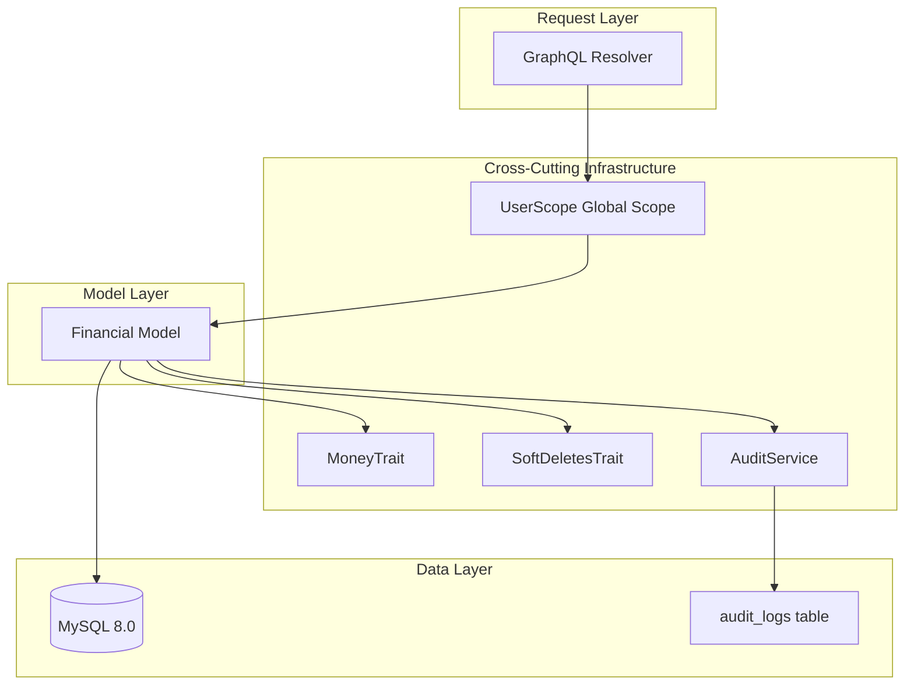
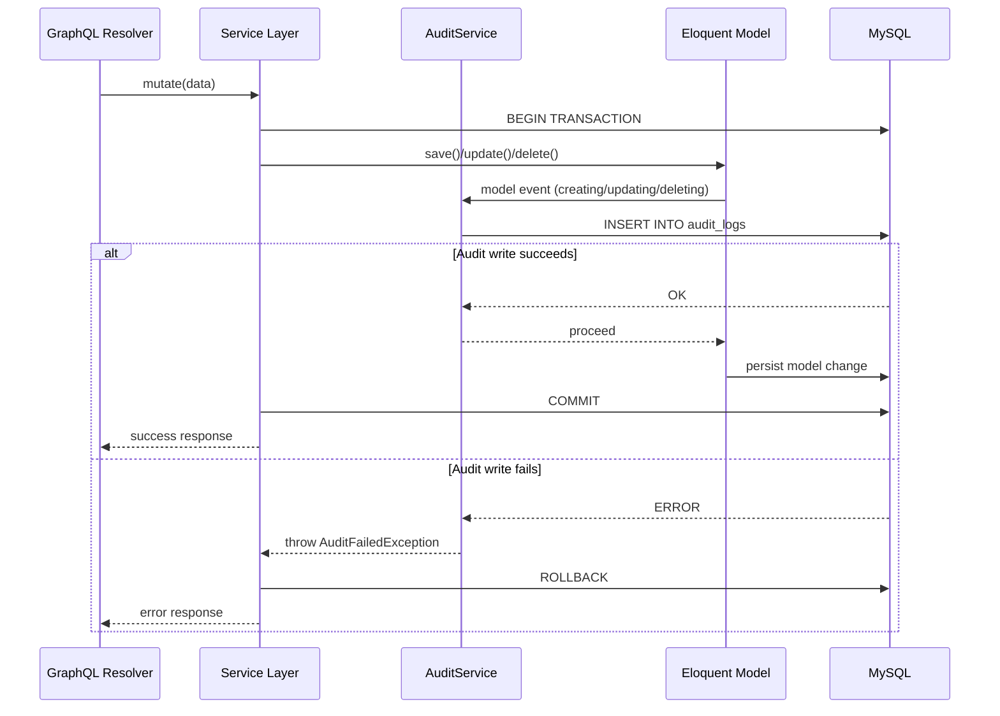
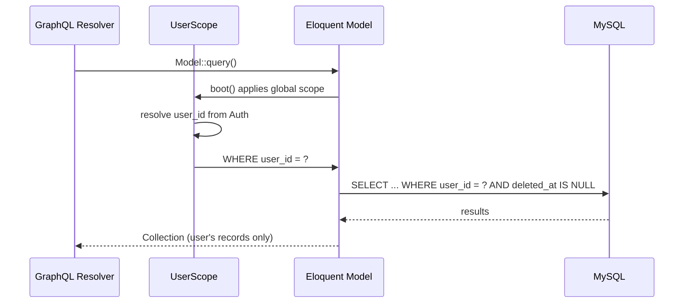
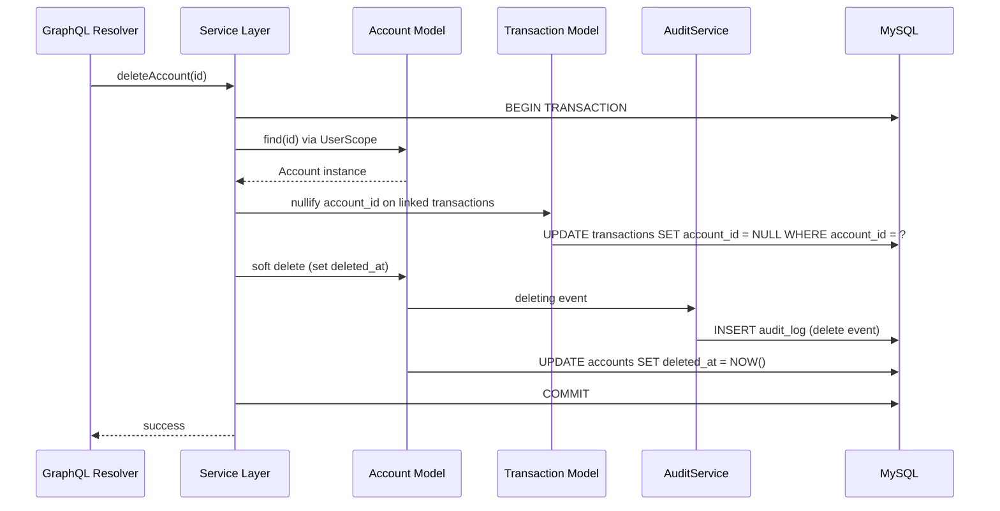

# Design Document: Foundation Infrastructure

## Overview

Foundation Infrastructure provides four cross-cutting concerns that all other features in the Budget & Expense Tracker depend on: monetary precision via integer centavo arithmetic, soft deletion with referential integrity, an immutable audit trail that blocks mutations on failure, and data isolation via Eloquent global scopes. These concerns are implemented as reusable traits, services, and model configurations that every financial model in the system will compose.

This design prioritizes composition over inheritance — each concern is an independent, testable trait or service that can be applied to any Eloquent model. The audit system operates as a transactional observer that wraps financial mutations in a database transaction, guaranteeing atomicity between the business operation and its audit record.

## Architecture



## Sequence Diagrams

### Audit-Wrapped Mutation Flow



### Data Isolation Query Flow



### Soft Delete with NullOnDelete Flow



## Components and Interfaces

### Component 1: Money Value Object & Trait

**Purpose**: Encapsulates all monetary arithmetic in centavos, provides safe division with remainder distribution, and handles conversion at API boundaries.

**Interface**:
```php
<?php

declare(strict_types=1);

namespace App\ValueObjects;

final readonly class Money
{
    public function __construct(
        private int $centavos,
    ) {}

    public static function fromCentavos(int $centavos): self;
    public static function fromPesos(float $pesos): self;
    public function toCentavos(): int;
    public function toPesos(): float;
    public function add(Money $other): self;
    public function subtract(Money $other): self;
    public function multiply(int $factor): self;
    public static function divide(int $totalCentavos, int $parts): array;
    public function format(): string;
    public function equals(Money $other): bool;
    public function greaterThan(Money $other): bool;
    public function isZero(): bool;
}
```

**Responsibilities**:
- Store monetary amounts as unsigned integers (centavos)
- Enforce range validation: 0–99,999,999,999
- Perform integer-only arithmetic (no floats in business logic)
- Distribute remainders evenly when dividing amounts
- Convert pesos ↔ centavos at API boundary only

### Component 2: HasMonetaryFields Trait

**Purpose**: Applied to Eloquent models to cast monetary database columns to/from the Money value object.

**Interface**:
```php
<?php

declare(strict_types=1);

namespace App\Traits;

trait HasMonetaryFields
{
    abstract protected function monetaryFields(): array;

    public function getMoneyAttribute(string $field): Money;
    public function setMoneyAttribute(string $field, Money|int $value): void;

    protected function initializeHasMonetaryFields(): void;
}
```

**Responsibilities**:
- Define which model columns are monetary
- Cast between database integers and Money value objects
- Validate centavo range on set operations

### Component 3: UserScope (Global Scope)

**Purpose**: Automatically filters all queries to the authenticated user's records, ensuring complete data isolation.

**Interface**:
```php
<?php

declare(strict_types=1);

namespace App\Scopes;

use Illuminate\Database\Eloquent\Builder;
use Illuminate\Database\Eloquent\Model;
use Illuminate\Database\Eloquent\Scope;

final class UserScope implements Scope
{
    public function apply(Builder $builder, Model $model): void;
}
```

**Responsibilities**:
- Add `WHERE user_id = ?` to every query on scoped models
- Resolve `user_id` from the authenticated session (server-side)
- Never accept `user_id` from request input
- Return not-found (not forbidden) when accessing another user's record

### Component 4: BelongsToUser Trait

**Purpose**: Applied to financial models to automatically register the UserScope and assign user_id on creation.

**Interface**:
```php
<?php

declare(strict_types=1);

namespace App\Traits;

use App\Scopes\UserScope;
use Illuminate\Database\Eloquent\Relations\BelongsTo;

trait BelongsToUser
{
    public static function bootBelongsToUser(): void;
    public function user(): BelongsTo;

    protected static function assignUserOnCreating(): void;
}
```

**Responsibilities**:
- Register UserScope in model's `booted()` lifecycle
- Auto-assign `user_id` from `Auth::id()` on `creating` event
- Ignore any `user_id` passed in request input
- Provide `user()` relationship method

### Component 5: AuditService

**Purpose**: Records immutable audit log entries within the same transaction as the originating mutation. Blocks the mutation if audit persistence fails.

**Interface**:
```php
<?php

declare(strict_types=1);

namespace App\Services;

use Illuminate\Database\Eloquent\Model;

final class AuditService
{
    public function logCreation(Model $model): void;
    public function logUpdate(Model $model, array $oldValues, array $newValues): void;
    public function logDeletion(Model $model): void;
    public function getHistory(string $entityType, int $entityId): Collection;
}
```

**Responsibilities**:
- Write audit records within the same DB transaction as the mutation
- Capture user_id, timestamp (UTC), entity type, entity ID, old/new values
- Throw `AuditFailedException` on write failure (triggering rollback)
- Prevent any update/delete on audit_logs table (immutability)
- Store audit records independently from audited entities

### Component 6: HasAuditTrail Trait

**Purpose**: Applied to Eloquent models to hook into model events and delegate to AuditService.

**Interface**:
```php
<?php

declare(strict_types=1);

namespace App\Traits;

trait HasAuditTrail
{
    public static function bootHasAuditTrail(): void;

    protected function getAuditableFields(): array;
    protected function getOriginalAuditValues(): array;
}
```

**Responsibilities**:
- Register `creating`, `updating`, `deleting` model event listeners
- Delegate audit logging to AuditService
- Define which fields are auditable per model
- Capture original values before mutation

### Component 7: SoftDeletes with NullOnDelete

**Purpose**: Extends Laravel's built-in SoftDeletes to additionally nullify foreign key references on dependent records when a parent is soft-deleted.

**Interface**:
```php
<?php

declare(strict_types=1);

namespace App\Traits;

use Illuminate\Database\Eloquent\SoftDeletes as BaseSoftDeletes;

trait SoftDeletesWithNullify
{
    use BaseSoftDeletes;

    abstract protected function nullifyOnDelete(): array;

    public function performSoftDelete(): void;
    public function restoreRecord(): void;
}
```

**Responsibilities**:
- Set `deleted_at` timestamp on soft delete
- Nullify configured foreign keys on dependent records
- Restore by clearing `deleted_at`
- Exclude soft-deleted records from standard queries
- Allow unique constraints scoped to non-deleted records

## Data Models

### AuditLog Model

```php
<?php

declare(strict_types=1);

namespace App\Models;

use Illuminate\Database\Eloquent\Model;

/**
 * Immutable audit log record.
 * No update or delete operations are permitted.
 *
 * @property int $id
 * @property int $user_id
 * @property string $auditable_type   (e.g., 'App\Models\Transaction')
 * @property int $auditable_id
 * @property string $event            ('created', 'updated', 'deleted')
 * @property array|null $old_values
 * @property array|null $new_values
 * @property string $created_at       (UTC, precision to second)
 */
final class AuditLog extends Model
{
    public $timestamps = false;

    protected $fillable = [
        'user_id',
        'auditable_type',
        'auditable_id',
        'event',
        'old_values',
        'new_values',
        'created_at',
    ];

    protected $casts = [
        'old_values' => 'array',
        'new_values' => 'array',
        'created_at' => 'datetime',
    ];
}
```

**Validation Rules**:
- `user_id`: required, unsigned bigint, references users.id
- `auditable_type`: required, string max 255
- `auditable_id`: required, unsigned bigint
- `event`: required, one of 'created', 'updated', 'deleted'
- `old_values`: nullable JSON (null for 'created' events)
- `new_values`: nullable JSON (null for 'deleted' events)
- `created_at`: required, UTC timestamp

### Database Migration: audit_logs

```php
<?php

use Illuminate\Database\Migrations\Migration;
use Illuminate\Database\Schema\Blueprint;
use Illuminate\Support\Facades\Schema;

return new class extends Migration
{
    public function up(): void
    {
        Schema::create('audit_logs', function (Blueprint $table) {
            $table->id();
            $table->unsignedBigInteger('user_id');
            $table->string('auditable_type');
            $table->unsignedBigInteger('auditable_id');
            $table->enum('event', ['created', 'updated', 'deleted']);
            $table->json('old_values')->nullable();
            $table->json('new_values')->nullable();
            $table->timestamp('created_at')->useCurrent();

            $table->foreign('user_id')->references('id')->on('users');
            $table->index(['auditable_type', 'auditable_id']);
            $table->index(['user_id', 'created_at']);
        });
    }

    public function down(): void
    {
        Schema::dropIfExists('audit_logs');
    }
};
```

### AuditEvent Enum

```php
<?php

declare(strict_types=1);

namespace App\Enums;

enum AuditEvent: string
{
    case Created = 'created';
    case Updated = 'updated';
    case Deleted = 'deleted';
}
```

## Algorithmic Pseudocode

### Remainder Distribution Algorithm

```pascal
ALGORITHM distributeAmount(totalCentavos, numberOfParts)
INPUT: totalCentavos ∈ ℤ, totalCentavos ≥ 0, totalCentavos ≤ 99,999,999,999
INPUT: numberOfParts ∈ ℤ, numberOfParts ≥ 1
OUTPUT: parts[] where sum(parts) = totalCentavos AND |parts| = numberOfParts

BEGIN
  ASSERT totalCentavos >= 0
  ASSERT numberOfParts >= 1

  basePart ← totalCentavos DIV numberOfParts
  remainder ← totalCentavos MOD numberOfParts

  parts ← ARRAY of size numberOfParts

  FOR i FROM 0 TO numberOfParts - 1 DO
    // LOOP INVARIANT: sum(parts[0..i-1]) = basePart * i + min(i, remainder)
    IF i < remainder THEN
      parts[i] ← basePart + 1
    ELSE
      parts[i] ← basePart
    END IF
  END FOR

  ASSERT sum(parts) = totalCentavos
  RETURN parts
END
```

**Preconditions:**
- `totalCentavos` is a non-negative integer within valid range
- `numberOfParts` is a positive integer ≥ 1

**Postconditions:**
- The returned array has exactly `numberOfParts` elements
- The sum of all elements equals `totalCentavos` exactly
- The first `remainder` elements are each `basePart + 1`
- The remaining elements are each `basePart`
- No element is negative

**Loop Invariants:**
- After iteration i: `sum(parts[0..i]) = basePart * (i+1) + min(i+1, remainder)`
- All assigned elements satisfy: `parts[j] ∈ {basePart, basePart + 1}`

### Peso-to-Centavo Conversion Algorithm

```pascal
ALGORITHM pesosToCentavos(pesoValue)
INPUT: pesoValue ∈ ℝ (float from API boundary)
OUTPUT: centavos ∈ ℤ OR ValidationError

BEGIN
  // Check decimal precision (max 2 decimal places)
  decimalPart ← pesoValue - FLOOR(pesoValue)
  scaledDecimal ← decimalPart * 100

  IF scaledDecimal ≠ ROUND(scaledDecimal) THEN
    RETURN ValidationError("Value has too many decimal places")
  END IF

  centavos ← ROUND(pesoValue * 100)

  IF centavos < 0 THEN
    RETURN ValidationError("Monetary value must be non-negative")
  END IF

  IF centavos > 99,999,999,999 THEN
    RETURN ValidationError("Monetary value exceeds maximum")
  END IF

  RETURN centavos
END
```

**Preconditions:**
- `pesoValue` is a numeric value received from API input

**Postconditions:**
- Returns integer centavos if input is valid
- Returns ValidationError if input has more than 2 decimal places
- Returns ValidationError if result is out of valid range
- Conversion is exact: `centavos / 100.0 ≈ pesoValue` (within float precision)

### Audit-Wrapped Mutation Algorithm

```pascal
ALGORITHM auditWrappedMutation(model, operation, data)
INPUT: model ∈ EloquentModel, operation ∈ {create, update, delete}, data ∈ Map
OUTPUT: result ∈ Model OR AuditFailedException

BEGIN
  ASSERT model uses HasAuditTrail trait
  ASSERT Auth::id() IS NOT NULL

  oldValues ← NULL
  IF operation = update THEN
    oldValues ← model.getOriginalAuditValues()
  ELSE IF operation = delete THEN
    oldValues ← model.getAuditableAttributes()
  END IF

  DB::beginTransaction()

  TRY
    // Perform the model operation
    IF operation = create THEN
      model.fill(data)
      model.save()
      newValues ← model.getAuditableAttributes()
    ELSE IF operation = update THEN
      model.update(data)
      newValues ← model.getChangedAuditValues()
    ELSE IF operation = delete THEN
      model.performSoftDelete()
      newValues ← NULL
    END IF

    // Write audit record (MUST succeed or rollback)
    auditLog ← AuditLog.create({
      user_id: Auth::id(),
      auditable_type: model.getMorphClass(),
      auditable_id: model.getKey(),
      event: operation,
      old_values: oldValues,
      new_values: newValues,
      created_at: NOW() in UTC
    })

    IF auditLog NOT persisted THEN
      THROW AuditFailedException
    END IF

    DB::commit()
    RETURN model

  CATCH AuditFailedException
    DB::rollback()
    THROW AuditFailedException("Mutation blocked: audit record could not be persisted")
  CATCH Exception
    DB::rollback()
    THROW original exception
  END TRY
END
```

**Preconditions:**
- Model uses `HasAuditTrail` trait
- User is authenticated (`Auth::id()` is non-null)
- Database connection is available

**Postconditions:**
- On success: both model change AND audit record are persisted atomically
- On audit failure: neither model change NOR audit record is persisted
- Audit record `created_at` is in UTC with at least second precision

**Loop Invariants:** N/A (no loops)

### Global Scope Application Algorithm

```pascal
ALGORITHM applyUserScope(queryBuilder, model)
INPUT: queryBuilder ∈ Eloquent\Builder, model ∈ EloquentModel
OUTPUT: queryBuilder with user_id constraint applied

BEGIN
  authenticatedUserId ← Auth::id()

  IF authenticatedUserId IS NULL THEN
    // No authenticated user — should not reach here in normal flow
    // Protected by middleware, but defensive check
    THROW AuthenticationException("No authenticated user")
  END IF

  queryBuilder.where('user_id', '=', authenticatedUserId)

  RETURN queryBuilder
END
```

**Preconditions:**
- Request has passed authentication middleware
- Model has a `user_id` column

**Postconditions:**
- All query results belong to authenticated user
- Queries for other users' records return empty (not forbidden)
- `user_id` constraint cannot be bypassed from external input

## Key Functions with Formal Specifications

### Function 1: Money::divide()

```php
<?php

/**
 * Divide a total amount into N equal parts with remainder distribution.
 *
 * @param int $totalCentavos Total amount to divide
 * @param int $parts Number of parts to divide into
 * @return int[] Array of centavo amounts summing to totalCentavos
 */
public static function divide(int $totalCentavos, int $parts): array
```

**Preconditions:**
- `$totalCentavos >= 0 && $totalCentavos <= 99_999_999_999`
- `$parts >= 1 && $parts <= 60` (max installments)

**Postconditions:**
- `count($result) === $parts`
- `array_sum($result) === $totalCentavos`
- First `$totalCentavos % $parts` elements equal `intdiv($totalCentavos, $parts) + 1`
- Remaining elements equal `intdiv($totalCentavos, $parts)`
- All elements are non-negative integers

**Loop Invariants:**
- After processing index `i`: `sum(result[0..i]) === basePart * (i+1) + min(i+1, remainder)`

### Function 2: Money::fromPesos()

```php
<?php

/**
 * Convert a peso float value (from API input) to a Money instance.
 *
 * @param float $pesos Peso value with at most 2 decimal places
 * @return self
 * @throws \InvalidArgumentException If value has too many decimal places or is out of range
 */
public static function fromPesos(float $pesos): self
```

**Preconditions:**
- `$pesos` is a numeric value
- `$pesos` has at most 2 decimal places

**Postconditions:**
- Returns `Money` instance where `toCentavos() === (int) round($pesos * 100)`
- Throws `InvalidArgumentException` if more than 2 decimal places
- Throws `InvalidArgumentException` if result < 0 or > 99,999,999,999

### Function 3: AuditService::logUpdate()

```php
<?php

/**
 * Log an update event for a financial record.
 * MUST be called within an active database transaction.
 *
 * @param Model $model The model being updated
 * @param array $oldValues Previous values of changed fields
 * @param array $newValues New values of changed fields
 * @throws AuditFailedException If audit record cannot be persisted
 */
public function logUpdate(Model $model, array $oldValues, array $newValues): void
```

**Preconditions:**
- Active database transaction exists
- `$model` has a primary key (is persisted)
- `$oldValues` and `$newValues` are non-empty arrays
- User is authenticated

**Postconditions:**
- AuditLog record persisted with event='updated', old/new values captured
- `created_at` stored in UTC with second precision
- On failure: throws `AuditFailedException` (caller must rollback)

### Function 4: UserScope::apply()

```php
<?php

/**
 * Apply user_id filtering to all queries on scoped models.
 *
 * @param Builder $builder The query builder
 * @param Model $model The model being queried
 */
public function apply(Builder $builder, Model $model): void
```

**Preconditions:**
- Model table has a `user_id` column
- Auth middleware has run (user is authenticated or request is rejected upstream)

**Postconditions:**
- Builder has `WHERE user_id = {authenticated_user_id}` constraint
- Constraint applies to SELECT, UPDATE, DELETE queries
- Cannot be removed by user-facing request parameters

### Function 5: SoftDeletesWithNullify::performSoftDelete()

```php
<?php

/**
 * Soft-delete the model and nullify configured foreign keys on dependents.
 */
public function performSoftDelete(): void
```

**Preconditions:**
- Model is not already soft-deleted
- Model's `nullifyOnDelete()` returns valid relationship definitions

**Postconditions:**
- `deleted_at` is set to current timestamp
- All configured foreign keys on dependent records are set to NULL
- Dependent records remain queryable (not deleted)
- Record is excluded from standard queries
- Record can be restored via `restoreRecord()`

## Example Usage

### Money Value Object Usage

```php
<?php

declare(strict_types=1);

// Creating money from centavos (internal)
$amount = Money::fromCentavos(150000); // ₱1,500.00

// Creating money from pesos (API boundary)
$fromApi = Money::fromPesos(1500.00); // converts to 150000 centavos

// Arithmetic
$total = $amount->add(Money::fromCentavos(50000)); // 200000 centavos
$difference = $total->subtract($amount); // 50000 centavos

// Division with remainder distribution
$parts = Money::divide(10000, 3); // [3334, 3333, 3333]
assert(array_sum($parts) === 10000);

// Division with no remainder
$evenParts = Money::divide(9000, 3); // [3000, 3000, 3000]

// Display formatting
echo $amount->format(); // "₱1,500.00"

// Validation at API boundary
try {
    $invalid = Money::fromPesos(10.999); // throws: too many decimal places
} catch (\InvalidArgumentException $e) {
    // "Value has too many decimal places"
}
```

### BelongsToUser Trait Usage

```php
<?php

declare(strict_types=1);

namespace App\Models;

use App\Traits\BelongsToUser;
use App\Traits\HasAuditTrail;
use App\Traits\SoftDeletesWithNullify;
use App\Traits\HasMonetaryFields;
use Illuminate\Database\Eloquent\Model;

final class Account extends Model
{
    use BelongsToUser;
    use HasAuditTrail;
    use SoftDeletesWithNullify;
    use HasMonetaryFields;

    protected $fillable = ['name', 'type', 'balance_centavos'];

    protected function monetaryFields(): array
    {
        return ['balance_centavos'];
    }

    protected function nullifyOnDelete(): array
    {
        return [
            // relationship name => foreign key column
            'transactions' => 'account_id',
        ];
    }

    protected function getAuditableFields(): array
    {
        return ['name', 'type', 'balance_centavos'];
    }
}
```

### Audit Trail in Action

```php
<?php

declare(strict_types=1);

// Creating a record — audit logged automatically
$account = Account::create([
    'name' => 'BDO Savings',
    'type' => AccountType::BankAccount,
    'balance_centavos' => 500000,
]);
// Audit log: event=created, new_values={name: "BDO Savings", type: "bank_account", ...}

// Updating a record — old values captured
$account->update(['name' => 'BDO Savings - Primary']);
// Audit log: event=updated, old_values={name: "BDO Savings"}, new_values={name: "BDO Savings - Primary"}

// Soft deleting — full record captured
$account->delete();
// Audit log: event=deleted, old_values={name: "BDO Savings - Primary", type: "bank_account", ...}
// Also: transactions.account_id set to NULL for this account's transactions

// Querying audit history
$history = app(AuditService::class)->getHistory('App\Models\Account', $account->id);
// Returns Collection of AuditLog entries, newest first
```

### Data Isolation Demonstration

```php
<?php

declare(strict_types=1);

// User A is authenticated (user_id = 1)
// All queries automatically scoped:
$accounts = Account::all();
// SQL: SELECT * FROM accounts WHERE user_id = 1 AND deleted_at IS NULL

// Attempting to access User B's record by ID:
$otherUserAccount = Account::find(999); // belongs to user_id = 2
// Returns NULL (not "forbidden") — identical to non-existent record

// Creating a record — user_id assigned from session:
$account = Account::create(['name' => 'New Account', 'type' => 'wallet']);
// $account->user_id === 1 (from Auth::id(), not from input)

// Even if request contains user_id:
$account = Account::create([
    'name' => 'Hacked',
    'type' => 'wallet',
    'user_id' => 999, // IGNORED — overwritten by BelongsToUser trait
]);
// $account->user_id === 1 (always from session)
```

### Soft Delete with Restore

```php
<?php

declare(strict_types=1);

// Soft delete
$category = Category::find(5);
$category->delete();
// category.deleted_at = '2025-01-15 10:30:00'
// transactions where category_id = 5 → category_id = NULL

// Category no longer appears in queries
$categories = Category::all(); // does NOT include id=5

// Restore
$category = Category::withTrashed()->find(5);
$category->restoreRecord();
// category.deleted_at = NULL
// NOTE: nullified foreign keys are NOT automatically restored

// Unique constraint scoping: can create new category with same name
$newCategory = Category::create(['name' => 'Food', 'type' => 'expense']);
// Works even if a soft-deleted 'Food' expense category exists
```

## Correctness Properties

*A property is a characteristic or behavior that should hold true across all valid executions of a system — essentially, a formal statement about what the system should do. Properties serve as the bridge between human-readable specifications and machine-verifiable correctness guarantees.*

### Property 1: Division Totality

*For any* valid total centavo amount (0 to 99,999,999,999) and any number of parts (1 to 60), dividing the total into N parts SHALL produce an array of exactly N integers whose sum equals the original total. No centavo is lost or created.

**Validates: Requirement 9.4**

### Property 2: Monetary Range Invariant

*For any* Money value object instance, the stored centavo value SHALL always be a non-negative integer within the range 0 to 99,999,999,999. Values outside this range are rejected at construction time.

**Validates: Requirement 9.1**

### Property 3: Peso-Centavo Conversion Round-Trip

*For any* valid centavo value whose peso representation has at most 2 decimal places, converting from centavos to pesos and back to centavos SHALL produce the original centavo value exactly.

**Validates: Requirements 9.3, 9.8**

### Property 4: Arithmetic Integrity

*For any* two Money values a and b, `a.add(b).toCentavos()` SHALL equal `a.toCentavos() + b.toCentavos()`. All Money arithmetic operates on integer centavos with no intermediate float operations.

**Validates: Requirement 9.2**

### Property 5: Invalid Peso Rejection

*For any* float value with more than 2 decimal places, `Money::fromPesos()` SHALL throw an InvalidArgumentException. No Money instance is created from imprecise input.

**Validates: Requirement 9.5**

### Property 6: Display Format Consistency

*For any* valid Money instance, the `format()` method SHALL produce a string matching the pattern "₱X,XXX.XX" with exactly 2 decimal places and proper thousands separators.

**Validates: Requirement 9.7**

### Property 7: Soft Delete Field Preservation

*For any* model record with any field values, soft-deleting the record SHALL only set the `deleted_at` column to a non-null timestamp — all other field values remain identical to their pre-deletion state.

**Validates: Requirement 10.2**

### Property 8: Soft Delete Query Exclusion

*For any* set of records where some have `deleted_at` set and some do not, a standard query SHALL return only records where `deleted_at` is null. No soft-deleted record appears in standard results.

**Validates: Requirement 10.3**

### Property 9: Soft Delete Restore Visibility Round-Trip

*For any* soft-deleted record, restoring it SHALL clear the `deleted_at` timestamp and make the record visible in standard queries again.

**Validates: Requirement 10.5**

### Property 10: Nullify on Delete

*For any* parent record with configured dependent relationships, soft-deleting the parent SHALL set all configured foreign key columns on dependent records to NULL.

**Validates: Requirement 10.4**

### Property 11: Audit Completeness and Structure

*For any* financial mutation (create, update, or delete), the system SHALL produce exactly one corresponding audit_log entry containing user_id, auditable_type, auditable_id, the correct event type, old_values, new_values, and a UTC created_at timestamp.

**Validates: Requirements 11.1, 11.2, 11.3, 11.4, 11.8**

### Property 12: Audit Value Nullability by Event Type

*For any* audit log with event "created", old_values SHALL be null. *For any* audit log with event "deleted", new_values SHALL be null.

**Validates: Requirements 12.3, 12.4**

### Property 13: Audit Immutability

*For any* existing audit_log record, any attempt to update or delete it at the application level SHALL be rejected. Audit records are append-only.

**Validates: Requirement 11.5**

### Property 14: Audit Atomicity

*For any* financial mutation where the audit log write fails, the entire database transaction (including the originating mutation) SHALL be rolled back. No financial change persists without its audit record.

**Validates: Requirement 11.7**

### Property 15: Auditable Field Filtering

*For any* model update where only non-auditable fields change, the HasAuditTrail_Trait SHALL NOT create an audit log entry. Only changes to declared auditable fields trigger audit recording.

**Validates: Requirement 11.9**

### Property 16: Audit History Ordering

*For any* entity with multiple audit log entries, retrieving the audit history SHALL return entries ordered from newest to oldest by created_at.

**Validates: Requirement 11.6**

### Property 17: User Query Isolation

*For any* query executed on a model using BelongsToUser_Trait by an authenticated user, the query SHALL include a WHERE user_id = {authenticated_user_id} constraint that applies to SELECT, UPDATE, and DELETE operations. All returned records have user_id matching the authenticated session.

**Validates: Requirements 13.1, 13.6**

### Property 18: Server-Side User Assignment

*For any* financial record creation, regardless of what user_id value is provided in request input, the persisted record's user_id SHALL equal Auth::id() from the server session.

**Validates: Requirement 13.3**

### Property 19: Cross-User Access Returns Not Found

*For any* authenticated user attempting to access a record belonging to a different user, the system SHALL return a not-found response indistinguishable from querying a non-existent record.

**Validates: Requirement 13.2**

### Property 20: Monetary Field Casting Round-Trip

*For any* valid centavo integer stored in a monetary database column, reading the field through HasMonetaryFields_Trait SHALL return a Money value object, and writing that Money value back SHALL persist the same integer centavo value.

**Validates: Requirements 14.1, 14.2**

## Error Handling

### Error Scenario 1: Audit Persistence Failure

**Condition**: AuditService cannot write to the `audit_logs` table (disk full, connection lost, constraint violation)
**Response**: `AuditFailedException` is thrown within the transaction
**Recovery**: Transaction is rolled back; no financial mutation persists. Client receives a 500-level error indicating the operation could not be completed. Retry is safe (no partial state).

### Error Scenario 2: Invalid Monetary Value at API Boundary

**Condition**: GraphQL input contains a peso value with more than 2 decimal places or exceeds maximum range
**Response**: `InvalidArgumentException` caught at resolver level, returned as GraphQL validation error
**Recovery**: Client receives field-level error message. No mutation attempted.

### Error Scenario 3: User Scope Resolution Without Authentication

**Condition**: UserScope is applied but `Auth::id()` returns null (should be impossible with middleware)
**Response**: `AuthenticationException` thrown as defensive measure
**Recovery**: Request rejected with 401. This scenario indicates middleware misconfiguration.

### Error Scenario 4: Soft Delete with Active Dependents (Business Rule)

**Condition**: User attempts to delete an account/category that has non-deleted transactions
**Response**: Service layer checks for active dependents before soft-deleting; returns validation error
**Recovery**: Client receives descriptive error ("Account has active transactions"). No deletion performed. User must reassign or delete transactions first.

### Error Scenario 5: Restore of Record with Conflicting Unique Constraint

**Condition**: User restores a soft-deleted record, but a new record with the same unique fields now exists
**Response**: Unique constraint violation caught; restoration fails
**Recovery**: Client receives error indicating name conflict. User must rename the existing record or the restored record.

## Testing Strategy

### Unit Testing Approach

**Library**: PHPUnit 11.x

Key unit test cases:
- `Money::divide()` with various total/parts combinations including edge cases (1 centavo / 3 parts)
- `Money::fromPesos()` validation (precision check, range check)
- `Money` arithmetic (add, subtract, multiply) with boundary values
- `UserScope::apply()` adds correct WHERE clause to builder
- `BelongsToUser` trait assigns user_id from Auth and ignores input
- `AuditService` creates correct log entries for each event type
- `SoftDeletesWithNullify` sets deleted_at and nullifies foreign keys

### Property-Based Testing Approach

**Property Test Library**: PHPUnit with custom data providers (or pest-plugin-property if adopted)

Key properties to verify via randomized inputs:
1. **Remainder distribution totality**: For random `total ∈ [0, 99999999999]` and `parts ∈ [1, 60]`, `array_sum(Money::divide(total, parts)) === total`
2. **Conversion round-trip**: For random valid peso values, `Money::fromPesos(x)->toPesos() === x` (within 2 decimal places)
3. **Arithmetic commutativity**: `a.add(b) === b.add(a)` for random Money values
4. **Scope isolation**: For random user pairs, User A's query never returns User B's records

### Integration Testing Approach

- Test audit trail atomicity: verify that when audit insertion is blocked (via mock), the model mutation is also rolled back
- Test UserScope with real database: create records for multiple users, verify queries return only authenticated user's data
- Test soft delete cascade: delete parent, verify foreign keys nullified on dependents
- Test unique constraint scoping: create record, soft-delete it, create another with same unique fields — must succeed

## Performance Considerations

- **UserScope**: Applied via index on `(user_id)` column — O(log n) lookup. Composite indexes `(user_id, deleted_at)` for filtered queries.
- **Audit writes**: Single INSERT per mutation, within same transaction. JSON columns for flexible schema. Index on `(auditable_type, auditable_id)` for history lookups.
- **Soft deletes**: `deleted_at IS NULL` condition on every query. Partial index recommended if MySQL version supports it, otherwise composite index with `deleted_at`.
- **Money operations**: Pure integer math — no allocations beyond primitive values. Division loop is O(n) where n = number of parts (max 60).

## Security Considerations

- **Data isolation is structural, not advisory**: The UserScope global scope is registered in model `boot()` — it cannot be removed by query parameters, GraphQL arguments, or middleware misconfiguration. Only `withoutGlobalScope(UserScope::class)` in PHP code can bypass it, and this is restricted to system-level background processes.
- **user_id assignment is server-side only**: The `BelongsToUser` trait explicitly overwrites any client-provided `user_id` with `Auth::id()`. Even if a GraphQL mutation accepts a `user_id` field, it is ignored.
- **Not-found vs. Forbidden**: Cross-user access returns 404 (not 403) to prevent user enumeration attacks. An attacker cannot distinguish between "record doesn't exist" and "record belongs to someone else."
- **Audit immutability**: The `AuditLog` model disables `update()` and `delete()` at the Eloquent level. Database-level triggers could provide additional protection, but the application layer is the first line of defense.
- **Transaction atomicity for audit**: By wrapping mutations and audit writes in the same DB transaction, there is no window where a mutation exists without its audit record.

## Dependencies

| Package | Purpose | Status |
|---------|---------|--------|
| Laravel 12.x (Eloquent) | Models, scopes, traits, events | Installed |
| PHP 8.4 | strict_types, enums, readonly | Installed |
| MySQL 8.0 | JSON columns, indexes, transactions | Installed |
| PHPUnit 11.x | Unit and integration testing | Installed |
| (None additional) | All infrastructure uses core Laravel | — |

**Design Decision**: This spec deliberately avoids external audit packages (like `owen-it/laravel-auditing`) in favor of a custom, minimal implementation. Reasons:
1. The requirement that audit failure blocks the mutation is non-standard and requires tight transactional control
2. The AuditLog model must be truly immutable (no update/delete) which many packages don't enforce
3. The implementation is simple enough (one table, one service, one trait) that the overhead of a package isn't justified
4. Fewer dependencies = smaller attack surface for security-critical infrastructure
